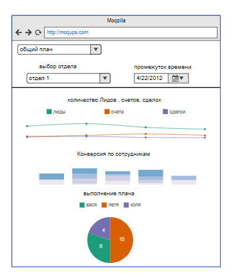
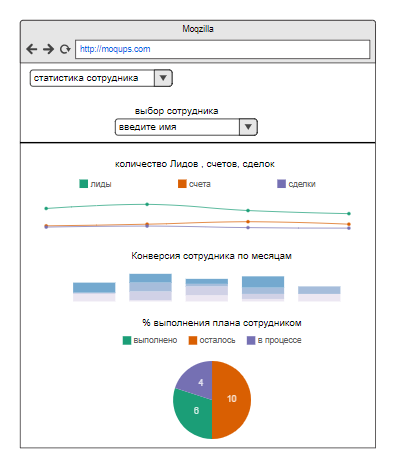

# Требования к проекту
### Содержание
  1. [Введение](#1)  
    1.1 [Назначение](#1.1)  
    1.2 [Бизнес-требования](#1.2)  
      1.2.1 [Исходные данные](#1.2.1)  
      1.2.2 [Границы проекта](#1.2.2)  
    1.3 [Аналоги](#1.3)  
  2. [Требования пользователей](#2)  
    2.1 [Программные интерфейсы](#2.1)  
    2.2 [Интерфейс пользователя](#2.2)  
    2.3 [Характеристики пользователей](#2.3)  
      2.3.1 [Классы пользователей](#2.3.1)  
      2.3.2 [Аудитория приложения](#2.3.2)  
    2.4 [Предположения и зависимости](#2.4)  
  3. [Системные требования](#3)  
    3.1 [Функциональные требования](#3.1)  
      3.1.1 [Вход пользователя в приложение](#3.1.1)  
      3.1.2 [Настройка профиля пользователя](#3.1.2)  
      3.1.3 [Взаимодействие пользователей](#3.1.3)  
      3.1.4 [Поисковый запрос](#3.1.4)  
      3.1.5 [Создание статьи](#3.1.5)  
    3.2 [Нефункциональные требования](#3.2)  
      3.2.1 [Атрибуты качества](#3.2.1)  
      3.2.2 [Бизнес-правила](#3.2.2)  
      3.2.3 [Внешний интерфейс](#3.2.3)  
      3.2.4 [Ограничения](#3.2.4)  

### 1 Введение 
#### 1.1 Назначение 

Данный документ описывает функциональные и нефункциональные требования к веб-приложению "Статистика продаж". Приложение является встраиваемым внешним решением для crm системы Битрикс24. Приложение предназначено для руководителей любого бизнеса, ведущего свои продажи через битрикс24, позволяет проводить быструю сквозную аналитику работы отдела продаж по всем ключевым показателям. 

#### 1.2 Бизнес-требования 
##### 1.2.1 Исходные данные 

В последние годы бизнес диктует новые условия и веяния, одним из них является автоматизация ведения продаж. Crm системы становятся все более популярными т.к позволяют существенно сократить временные затраты на этапе взаимодействия клиента и продавца услуги. Одной из таких систем является битрикс24, разработка расширений под битрикс24 является перспективной нишей на данный момент. 

##### 1.2.2 Границы проекта 

Приложение можно страивать в битрикс24 любой организации. Оно собирается статистику по работе отдела продаж, строит графики, таблицы и диаграммы на основании этих данных и позволяется администратору производить анализ работы его компании

#### 1.3 Аналоги 
Непосредственных аналогов по функционалу   для  приложения  в marketplace(магазин приложений) bitrix24 нет, либо эти приложения находятся в закрытом доступе. Части функционала есть в «заводских» модулях crm, таких как «старт», «сотрудники», однако комплексного решения на данный момент я не обнаружил.

### 2. Требования пользователей 
#### 2.1 Программные интерфейсы 
  - Должен быть реализован сбор статистики из crm 
  - Должен быть реализован подсчет ключевых показателей продаж, таких как количество лидов, счетов, сделок, процент выполнения плана, подсчет конверсии и акцептации.
  - Должен быть реализован вывод статистики в графиках и таблицах.
-Реализован функционал выставление и изменения плана продаж для сотрудников.

#### 2.2 Интерфейс пользователя 
- Главный экран выгрузки статистики в приложение.
  
- Страница изменения плана
  
- Страница статистики по всей компании
  
- Страница вывода статистики по сотрудникам
  

#### 2.3 Характеристики пользователей 
##### 2.3.1 Классы пользователей 
| Класс | Описание |
|:---|:---|
| Анонимные пользователи | Нет доступа к приложению|
| Зарегистрированные пользователи | Авторизованные пользователи, с подтвержденными правами в битрикс24. Имеют доступ к полному функционалу в рамках своего профиля |
| Администраторы | Пользователи, которые авторизовались специальным способом и имеют доступ ко всей информации. В том числе к выставлению и изменению плана продаж. |

##### 2.3.2 Аудитория приложения 

Аудитория представляет из себя людей работающих в бизнесах, которые использую внутри своей компании битрикс24. Предназначены для руководителей, администраторов, менеджеров, в обязанность которых входит аналитика работы специалистов отдела продаж. Приложение существенно сокращает их временные затраты на ручной подсчет статистики и построении аналитических графиков в BI-системах. 

#### 2.4 Предположения и зависимости 

Приложение должно быть максимально универсальным , не зависеть от тематики конкретного бизнеса. Исключить зависимость от выхода новых версий crm и каких-либо внешних сервисов. 

### 3 Системные требования 
Наличие последних версий браузера и битрикс24. 
#### 3.1 Функциональные требования 
##### 3.1.1 Вход пользователя в приложение 
**Описание.** Пользователь может войти в приложение по прямой ссылки, при условии, что он зарегистриарован в битрикс24, и  для данного пользователя выданы соответствующие права в панели администратора crm.
| Функция | Требования |
|:---|:---|
| Вход в приложение без создания собственного профиля | Приложение должно предоставить пользователю возможность войти в приложение анонимно |
| Регистрация нового пользователя | Приложение должно запросить у пользователя ввести имя и пароль для создания учётной записи. Пользователь должен либо ввести, либо отменить действие |
| *Пользователь с таким именем существует* | *Приложение должно известить пользователя об ошибке регистрации и запросить ввод* |
| Вход зарегистрированного пользователя в приложение | Приложение должно запросить у пользователя ввести имя и пароль для авторизации. Если данные введены верно, то пользователю разблокируется функционал, в противном случае приложение должно запросить повторный ввод |

##### 3.1.2 Настройка профиля пользователя 
**Описание.** Зарегистрированный пользователь имеет возможность редактировать свою личную информацию.

| Функция | Требования |
|:---|:---|
| Изменение личной информации | Приложение должно предоставить пользователю возможность изменить имя, адрес, список тем, биографию и фотографию |
| Удаление статей | Приложение должно позволять пользователю удалять его статьи |
| Удаление комментариев | Приложение должно позволять пользователю удалять его комментарии |
| Удаление профиля | Приложение должно предоставить пользователю возможность полного удаления блога |

##### 3.1.3 Взаимодействие пользователей 
**Описание.** После входа пользователи могут взаимодействовать друг с другом.

| Функция | Требования |
|:---|:---|
| Оставление комментариев | Приложение должно позволять авторизованным пользователям оставлять комментарии под записями любых блогов |
| Оценка комментариев | Приложение должно предоставить авторизованному пользователю возможность оценивать комментарии других пользователей |
| Оценка профиля | Приложение должно предоставить авторизованному пользователю возможность оценивать страницы других пользователей |
| *Оценка своих комментариев и своего профиля* | *Приложение должно известить пользователя о том, что самого себя оценивать нельзя* |
| *Повторная оценка* | *Приложение должно известить пользователя о том, что он уже оценивал этот комментарий или блог* |

##### 3.1.4 Поисковый запрос 
**Описание.** Любой пользователь имеет возможность оправить поисковый запрос.

**Требование.** Приложение должно предоставить найденные совпадения по названиям статей и профилей с поисковым запросом.

#### 3.2 Нефункциональные требования 
##### 3.2.1 Атрибуты качества 

Проект должен быть небольшим (иметь менее 10 разновидностей страниц), удобным (доступ к основным функциям приложения не более чем за две операции) и управляемым (пользователь может отменить все свои действия).

##### 3.2.2 Бизнес-правила 

 Приложение работает в конфиденциальными данными компании, большой упор сделан на то, чтобы не выносить статистику на сторонние сервисы и работать в рамках приватных баз данных конкретной компании, что поможет обезопасить от нежелательного перехвата синформации.  

##### 3.2.3 Внешний интерфейс 
Приложение должно:
- быть разработано в одном стиле;
- название кнопок в интерфейсе максимально понятно отражает функционал.
- все графики и таблицы имеют подписи.

##### 3.2.4 Ограничения 

Вся статистика обрабатывается исключительно насервере, в браузере только построение графиков. Доступ только для подтвержденных пользователей. 

